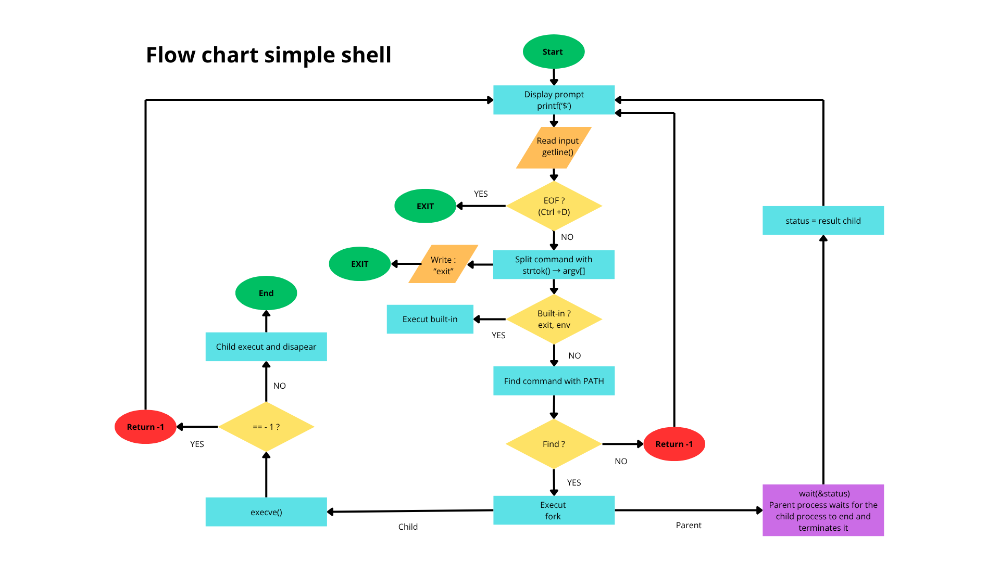

# Holberton School - Simple Shell: `hsh`

## Table of Contents
- [Overview](#overview)
  - [Summary](#summary)
  - [Copyright](#copyright)
- [How to install and run](#how-to-install-and-run)
  - [Prerequisites](#prerequisites)
  - [1. Downloading](#1-downloading)
  - [2. Compiling](#2-compiling)
  - [3. Starting program](#3-starting-program)
- [How to use](#how-to-use)
  - [Interactive mode](#interactive-mode)
  - [Non-interactive mode](#non-interactive-mode)
  - [Built-in commands](#built-in-commands)
- [Technical information](#technical-information)
  - [General architecture](#general-architecture)
    - [Process flow](#process-flow)
    - [File structure and Responsibilities](#file-structure-and-responsibilities)
  - [Testing & Edge Cases](#testing--edge-cases)
  - [Memory management](#memory-management)

<p align="center">
    
</p>

## Overview

**hsh** is a command-line interpreter that replicates the basic functionalities of the standard Unix shell (`/bin/sh`).

### Summary
This project aims to demonstrate the fundamental concepts of an operating system:
* Process creation and management (`fork`, `wait`, `execve`).
* Handling the environment and `PATH` resolution.
* Tokenization and parsing of user input.
* Memory management in C.

### Copyright
This program has been developed by:
* David Lengelle
* Erwan Barat

Project realized for **Holberton School**. Distributed under the terms of the GPL v3.0.

## How to install and run

### Prerequisites
You must have a C compiler (GCC) and the standard C libraries installed on a Linux-based system (Ubuntu 20.04 LTS is recommended).

### 1. Downloading
```bash
git clone https://github.com/Rwanbt/holbertonschool-simple_shell.git
cd holbertonschool-simple_shell
```

### 2. Compiling
The shell is compiled using the following flags to ensure strict adherence to the GNU89 standard:
```bash
gcc -Wall -Werror -Wextra -pedantic -std=gnu89 *.c -o hsh
```

### 3. Starting program
The shell can be launched in two different modes:

**Interactive Mode:**
```bash
./hsh
($) /bin/ls
```

**Non-Interactive Mode:**
```bash
echo "/bin/ls" | ./hsh
```

## How to use

### Interactive mode
Once launched, the shell displays a prompt (`$`) and waits for the user to type a command. It supports commands with their full paths (e.g., `/bin/ls`) or simple command names if they are located in the `PATH` (e.g., `ls`).

### Non-interactive mode
The shell can also read commands from a pipe or a file, making it suitable for scripting and automated testing.

### Built-in commands
| Command | Description |
|---------|-------------|
| `exit`  | Terminates the shell and returns to the parent process. |
| `env`   | Prints all current environment variables. |

## Technical information

### General architecture
The shell follows a continuous **Read-Parse-Execute** loop:
1. **Prompt**: Displays the symbol and waits for input using `getline`.
2. **Parser**: Splits the input string into tokens (command and arguments) using `strtok`.
3. **Path**: Searches for the command in the directories listed in the `PATH` environment variable.
4. **Executor**: Creates a child process (`fork`), executes the command (`execve`), and waits for completion (`wait`).

#### Process flow




### File structure and Responsibilities
| Filename | Role | Primary Contributor |
|----------|------|-------------------|
| `main.h` | Header with all prototypes and library inclusions. | Shared |
| `simple_shell.c` | Entry point and main loop logic. | [Collègue] |
| `prompt.c` | Handles prompt display and `getline` reading. | [Collègue] |
| `parser.c` | Tokenizes user input into an array of strings. | [Collègue] |
| `executor.c` | Manages the `fork`, `execve`, and `wait` sequence. | [Collègue] |
| `path.c` | Resolution of command location via `PATH`. | [Toi] |
| `builtins.c` | Implementation of `exit` and `env` commands. | [Toi] |
| `utils.c` | String utility functions (`_strlen`, `_strcmp`, etc.). | [Toi] |
| `man_1_simple_shell` | Official manual page for the shell. | [Collègue] |
| `AUTHORS` | List of project contributors. | [Collègue] |

### Testing & Edge Cases
As part of the development, the following edge cases were specifically handled:
* **EOF (Ctrl+D)**: Graceful exit from the shell.
* **Empty commands**: Pressing Enter without input does not crash the program.
* **Spaces**: Handles multiple spaces and tabs between arguments.
* **Invalid PATH/Command**: Displays an error message if the command is not found.

### Memory management
Every allocation is tracked and freed to ensure 0 memory leaks. Verified with:
```bash
valgrind --leak-check=full --show-leak-kinds=all ./hsh
```
Expected clean output:
```
==XXXX== All heap blocks were freed -- no leaks are possible
==XXXX== ERROR SUMMARY: 0 errors from 0 contexts
```
#### Technologies
<p align="center">
    
    
    
    
</p>
